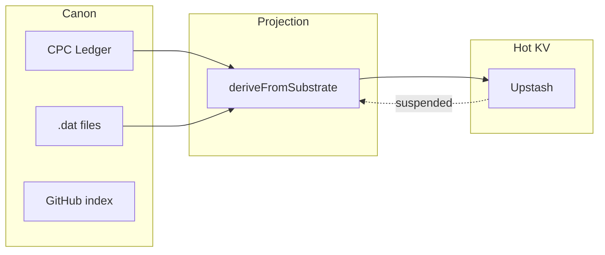

# Mobius KV Sovereignty — Architecture Spec (C-356)

**Cycle:** C-356  
**Status:** Proposed  
**Parent:** C-355 (`hot_database_is_cache`, `.dat` canon, CPC hash anchors)  
**Trigger:** Upstash budget suspension — 2026-06-27 production logs (`mobius-civic-ai-terminal`)

---

## Incident summary

On 2026-06-27, Upstash Redis returned:

```text
ERR This database has been suspended for exceeding the defined budget limit.
```

Every `[mobius-kv]` operation failed across crons, digest, journal writes, and agent
meta updates. Heartbeat returned **503**. Agent journal POSTs returned **500**. EVE
cycle-synthesize failed mid-tripwire write. Most read paths returned **200** only
because Vercel edge cache was `STALE` — not because KV was healthy.

**Root cause:** rented KV is treated as **memory** (source of truth), not **cache**
(disposable projection). This violates `mobius.yaml` policy:

```yaml
hot_database_is_cache: true
reserve_blocks_are_canon_artifacts: true
cpc_stores_hash_anchors_not_full_canon: true
```

---

## Constitutional model

```text
CANON       = CPC ledger + .dat reserve blocks + GitHub commits   (never suspends)
PROJECTION  = derived state recomputed from canon on read miss    (GI, journal index)
HOT KV      = Upstash / edge cache with TTL                       (performance only)
```

When KV dies, the system must:

1. **Continue operating** — no 503 on crons that can derive state
2. **Degrade visibly** — `kv_suspended: true`, `source: "substrate-fallback"`
3. **Never lose canon** — seals, journals, and GI history recoverable from CPC



---

## Key classification table

Keys observed in production logs (2026-06-27). Every Terminal KV key must map to
exactly one tier. **Tier 1 keys must never be the sole copy of irrecoverable state.**

| KV key (prefix `mobius:` unless noted) | Tier | Recoverable from | On KV miss |
|----------------------------------------|------|------------------|------------|
| `gi:latest` | **1 — Derived** | CPC attestations + sentinel signals | Recompute GI via integrity cron logic |
| `gi:trend` | **1 — Derived** | `gi:latest` history or CPC event window | Rebuild last N GI snapshots |
| `gi:latest_carry` | **1 — Derived** | Same as `gi:latest` | Same |
| `journal:index` | **1 — Derived** | CPC `get_epicon_feed` / mesh entries | Rebuild `{agent, cycle, key, updatedAt}[]` |
| `journal:{AGENT}:{CYCLE}` | **2 — Canon-bound** | CPC EPICON ingest + Git canon | Read from CPC; KV is cache only |
| `mic:readiness:snapshot` | **1 — Derived** | CPC vault + MIC events + `readiness_proof.hash` | Recompute readiness; verify hash |
| `mic:readiness:feed` | **1 — Derived** | Readiness snapshots | Rebuild list from projection |
| `mic:quorum:{CYCLE}` | **1 — Derived** | Sentinel attestations in CPC/mesh | Recompute quorum state |
| `vault-attestation:lastRun` | **3 — Checkpoint** | CPC seal events / `.dat` index | Default to epoch; cron re-runs |
| `heartbeat:last` | **3 — Checkpoint** | Cron schedule | Default to epoch |
| `LAST_PROMOTION_RUN_AT` | **3 — Checkpoint** | Promotion cron schedule | Default to epoch |
| `reattest:c314-migration-done` | **3 — Checkpoint** | One-time migration flag | Safe to re-run idempotently |
| `cache:integrity-status` | **4 — Ephemeral** | N/A | Recompute on next request |
| `cache:lane-diagnostics` | **4 — Ephemeral** | N/A | Recompute on next request |
| `snapshot:coalesce` | **4 — Ephemeral** | Terminal snapshot API | Recompute |
| `signals:micro:cache:v2` | **4 — Ephemeral** | External signal APIs | Refetch |
| `signals:latest` | **1 — Derived** | Signal ingest + CPC | Recompute |
| `echo:state` | **1 — Derived** | Digest projection | Recompute |
| `tripwire:state` | **1 — Derived** | EVE synthesis + CPC | Recompute |
| `tripwire:kv:heartbeat` | **3 — Checkpoint** | Tripwire cron | Default to epoch |
| `TRIPWIRE_STATE` (raw) | **1 — Derived** | Same as `tripwire:state` | Migrate to `mobius:` prefix |
| `system:pulse` | **1 — Derived** | CPC `mesh-pulse-snapshot.json` | Read from CPC/repo |
| `SENTIMENT_SNAPSHOT` | **1 — Derived** | Promote cron inputs | Recompute |
| `ledger:circuit_open` | **3 — Checkpoint** | CPC health probe | Re-probe CPC |
| `swarm:budget:daily*` | **4 — Ephemeral** | N/A | Reset daily budget window |
| `swarm:bus:agent:{NAME}` | **4 — Ephemeral** | Agent observe endpoints | Re-fetch bus state |
| `agent:meta:{name}` | **1 — Derived** | CPC journal entries for agent | Read last journal from CPC |

### Tier definitions

| Tier | Name | KV required? | Example failure mode if lost |
|------|------|--------------|------------------------------|
| **1** | Derived | No | Stale GI until next recompute — **not amnesia** |
| **2** | Canon-bound | No (CPC/Git is canon) | KV miss → read CPC |
| **3** | Checkpoint | No | Cron runs sooner than scheduled — idempotent |
| **4** | Ephemeral | No | Cache miss — refetch |

---

## CPC substrate endpoints (fallback sources)

When KV is suspended, Terminal projections should read from these CPC surfaces:

| Need | CPC endpoint / artifact | MCP tool |
|------|-------------------------|----------|
| GI / integrity | `/health`, GI_STATE_JSON, attestations | `get_integrity_snapshot` |
| EPICON / journal index | `/epicon/feed`, mesh ingest | `get_epicon_feed` |
| Vault / MIC readiness | `/api/vault/global`, vault routes | `get_vault_status` |
| Agent journals | EPICON entries filtered by agent | `get_agent_journal` |
| Reserve block canon | `ledger/reserve-blocks/*.dat` | `get_reserve_block_index` |
| Reserve block anchors | `POST /api/reserve-blocks/anchor` | — |
| Hash index | `ledger/reserve-block-index.json` | `get_reserve_block_index` |

Base URL: `https://civic-protocol-core-ledger.onrender.com`

---

## Reserve block seal flow (C-355 — canon path)

KV suspension must **not** block sealing. Order of operations:

```text
1. Compute seal payload + readiness_proof.hash
2. POST /api/reserve-blocks/anchor  (hash only — CPC)
3. repository_dispatch → write .dat   (GitHub canon)
4. KV write (optional, hot cache)   (may fail — non-fatal)
```

---

## Success criteria

- [ ] No cron returns **503** solely because Upstash is suspended
- [ ] `gi:latest` derivable from CPC within one heartbeat cycle
- [ ] `journal:index` rebuildable from `get_epicon_feed`
- [ ] Reserve block seal completes with KV down (steps 2–3 succeed)
- [ ] All Tier 1 keys documented in Terminal `lib/substrate/kv-registry.ts`
- [ ] Upstash upgraded or budget-capped as interim ops measure

---

## Related docs

- [C-356 Terminal handoff](./C-356_TERMINAL_KV_RESILIENCE_HANDOFF.md) — `resilientRead.ts` / `resilientWrite.ts`
- [C-355 EPICON entry](../../epicon/C-355_AUREA_RESERVE_BLOCK_PROOF_INDEX.md)
- [Mobius deploy drift routine](./MOBIUS_DEPLOY_DRIFT_ROUTINE.md)

---

*"KV is cache. The ledger is proof. The .dat file is canon." — Mobius Systems*
